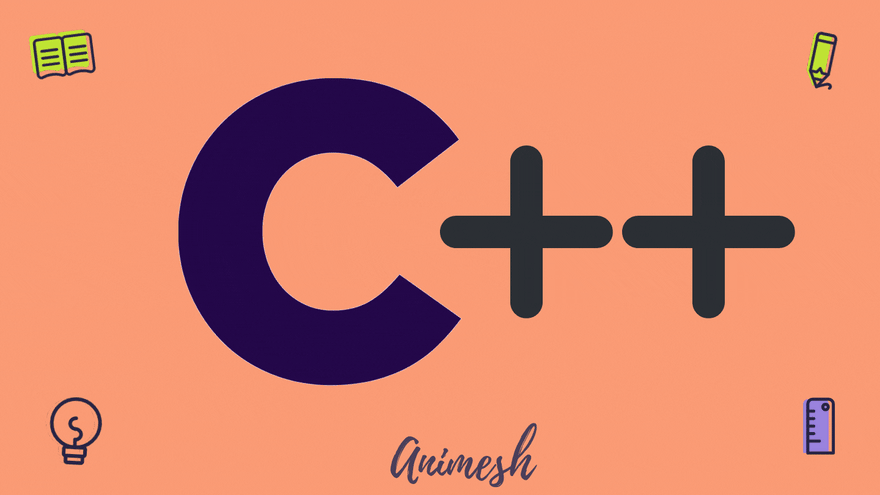

# Cpp

# Topics Coverd In Notes :-
# 1. History Of C++ 
# 2. Features of C++ 
# 3. OOP'S 
# 4. Classes & Object
# 5. Types of Variables 
# 6. Identifiers,Constents,Keywords
# 7. Header Files
# 8. Functions
# 9. Inline Function
# 10. Classes & Structures
# 11. Constructors & its Types
# 12. Destructors
# 13. Overloading & its Types
# 14. Friend Function
# 15. Inheritence & it's Types 
# 16. Memory units
# 17. Infix.PostFix,Prefix Notations
# 18. Modifiers & it's Types
# 19. PreProcessor & Directives
# 20. NamesSpace

